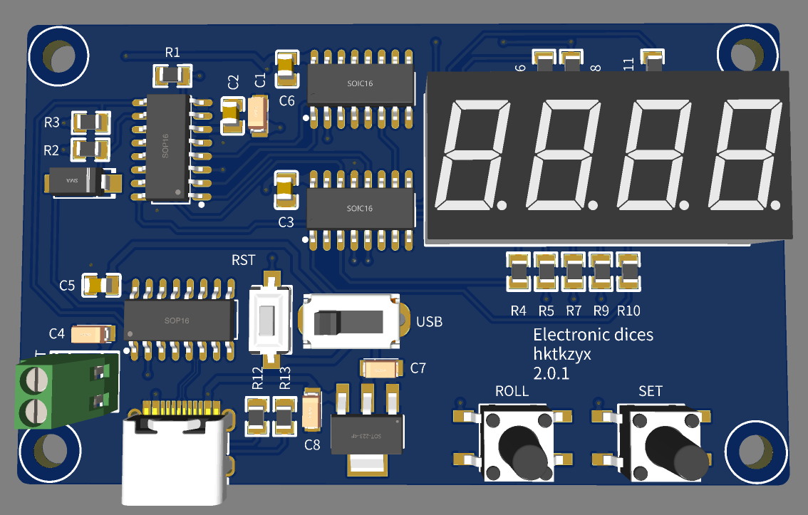

# Electronic dice STC 电子骰子

## 简介

Electronic dice STC 是一个基于STC单片机的电子骰子项目。
本项目利用51单片机生成伪随机数模拟投掷最多4个骰子。
可以用于卡坦岛等对随机数质量要求较高的桌游等场景。

<figure markdown>
  
  <figcaption>电子骰子3D渲染图</figcaption>
</figure>

## 使用

### 电源

外接3.3 V电源或Type C。
外接电源可以使用2节干电池。
拨动开关切换电源，左侧使用外接3.3 V电源，右侧使用Type C。

### 功能

`Set`键调整骰子数量，默认2个骰子。
`Roll`键投掷骰子。
连续未操作自动进入休眠模式，直至再次按键。
进入休眠的时间可以在固件中设置。

## 许可证

[CERN-OHL-P v2](https://ohwr.org/cern_ohl_p_v2.txt) or later
